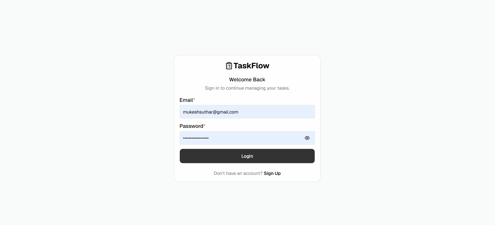
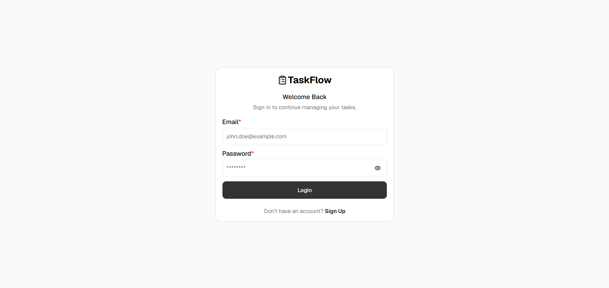
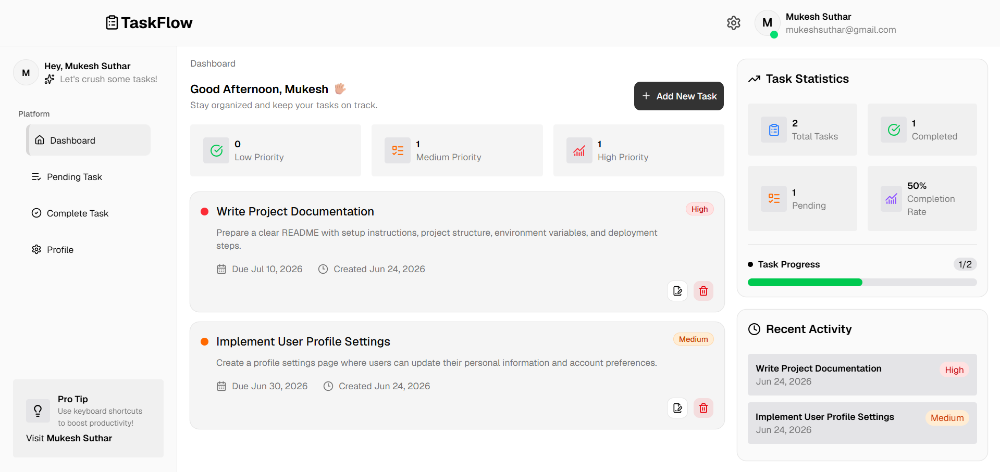
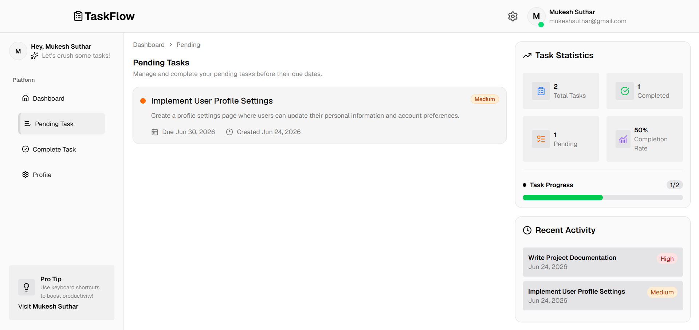
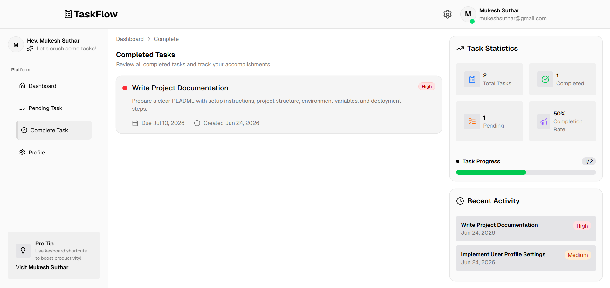
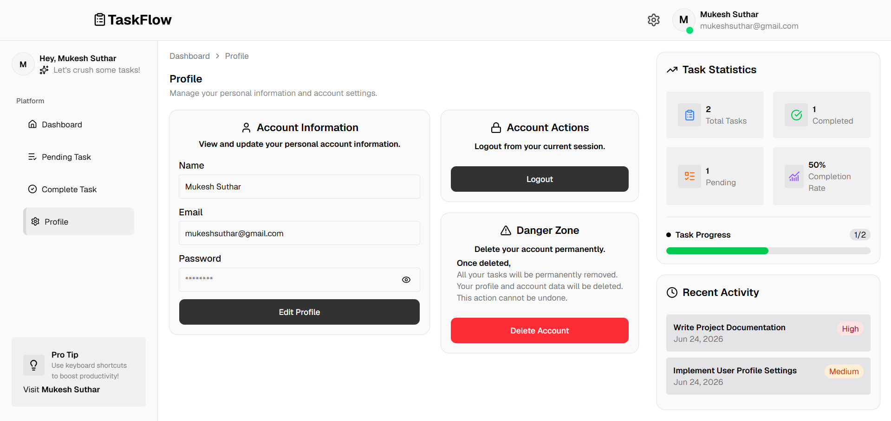

# 🚀 TaskFlow

## 🎥 Live Demo



A modern full-stack Task Management application that helps users organize, prioritize, and manage daily tasks efficiently. Built with React, Node.js, Express, and MongoDB, TaskFlow provides a clean UI, secure authentication, and a seamless task management experience.

---

## 🌐 Live Demo

### Frontend

https://taskflow-mukeshsuthar.vercel.app

---

## 📸 Screenshots

### 🔐 Login



---

### 📊 Dashboard



---

### 📌 Pending Tasks



---

### ✅ Completed Tasks



---

### 👤 Profile



---

## ✨ Features

### 🔐 Authentication

- User Signup
- User Login
- Secure Logout
- JWT Authentication
- HTTP-Only Cookie Authentication

---

### 📋 Task Management

- Create Tasks
- View Tasks
- Update Existing Tasks
- Delete Tasks

---

### 🚦 Task Status

- In Progress
- Completed

---

### 🎯 Task Priority

- Low Priority
- Medium Priority
- High Priority

---

### 📊 Dashboard

- View all tasks
- Task Overview Cards
- Priority Statistics
- Recent Task Activity
- Create New Task
- Edit Existing Task
- Delete Task

---

### 📌 Pending Tasks

- Displays only pending tasks
- Read-only task list
- Empty Task
- Go to Dashboard shortcut

---

### ✅ Completed Tasks

- Displays only completed tasks
- Read-only task list
- Empty Task
- Go to Dashboard shortcut

---

### 👤 Profile Management

- Update Name
- Update Password
- View Email Address
- Logout
- Delete Account

#### 🗑 Account Deletion

When a user deletes their account:

- User account is permanently removed.
- All associated tasks are automatically deleted.
- This action cannot be undone.

---

### 📱 Responsive Design

- Mobile Responsive
- Tablet Responsive
- Desktop Responsive

---

### 🔒 Security

- Protected Routes
- Secure REST APIs
- Password Hashing (bcrypt)
- JWT Authentication
- HTTP-Only Cookies
- Input Validation using Zod

---

## 🛠 Tech Stack

### Frontend

- React.js
- Vite
- PNPM
- Tailwind CSS
- shadcn/ui
- Redux Toolkit
- React Hook Form
- Zod
- Axios
- React Router DOM

### Backend

- Node.js
- Express.js
- MongoDB
- Mongoose
- JWT
- Bcrypt.js
- Cookie Parser
- CORS

---

## 📂 Project Structure

```text
taskflow
│
├── client
│
├── server
│
└── README.md
```

---

## ⚙️ Installation

### Clone Repository

```bash
git clone https://github.com/mukeshh24/taskflow.git
```

---

### Frontend

```bash
cd client
pnpm install
pnpm dev
```

---

### Backend

```bash
cd server
npm install
npm run dev
```

---

## 🚀 Pages

- Dashboard
- Pending Tasks
- Completed Tasks
- Profile

---

## 💡 Highlights

- Full Stack CRUD Application
- Authentication & Authorization
- Priority-based Task Management
- Recent Task Activity
- Responsive UI
- Reusable Components
- Clean Folder Structure
- Context API + Redux Toolkit
- RESTful APIs
- Production Deployment

---

## 🚀 Deployment

Frontend

- Vercel

Backend

- Render

Database

- MongoDB Atlas

---

## 👨‍💻 Author

Mukesh N. Suthar

GitHub

https://github.com/mukeshh24

LinkedIn

https://linkedin.com/in/mukesh-sutharr

Portfolio

https://mukeshsuthar.vercel.app/

---

⭐ If you like this project, don't forget to give it a star.
